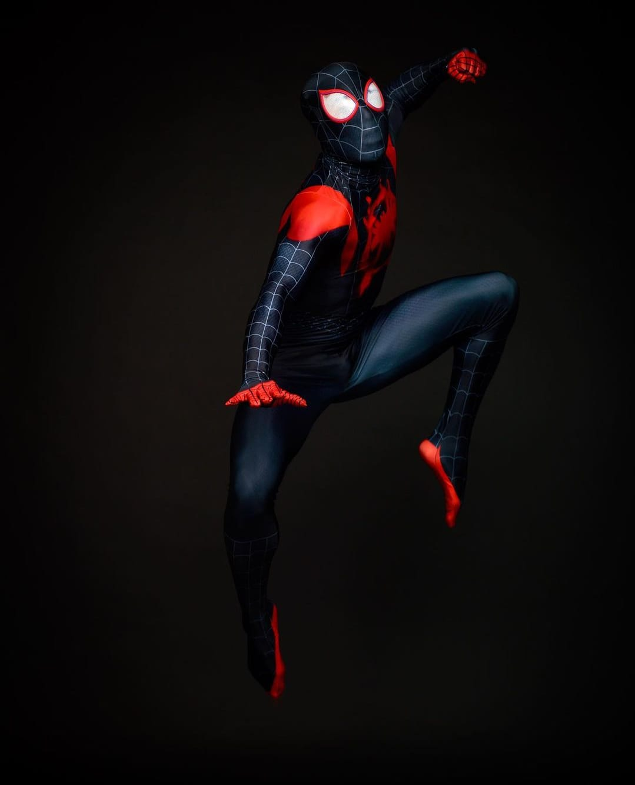

# Task 2 - Transformation

Transformation geometry for Digital Image Processing assignment made from Pascal language using Lazarus IDE.

## Usage

1. Click the `Load` button and load the sample picture located in `picture` folder  

Note: You can download the sample picture [here](https://drive.google.com/file/d/1xPo0yygPyoUn6gLx3VfeZQjxPdJdTUYp/view?usp=sharing)  

2. Slide the track bar position into whatever you like  

