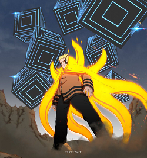

# Task 3 - Filtering

Filtering process for Digital Image Processing based on High Pass Filtering or Low Pass Filtering.

## Usage

1. Click the `load` button and load the sample picture located in `picture` folder  

Note: You can download the sample picture [here](https://drive.google.com/file/d/1lxTLzmBs8vP3yWUaUQ5YEoAOtz2ARwsC/view?usp=sharing)  

2. Input the kernel size as you want  
3. Select color mode and filter mode  
4. Click the `Convolution` button or `Correlation` button  

